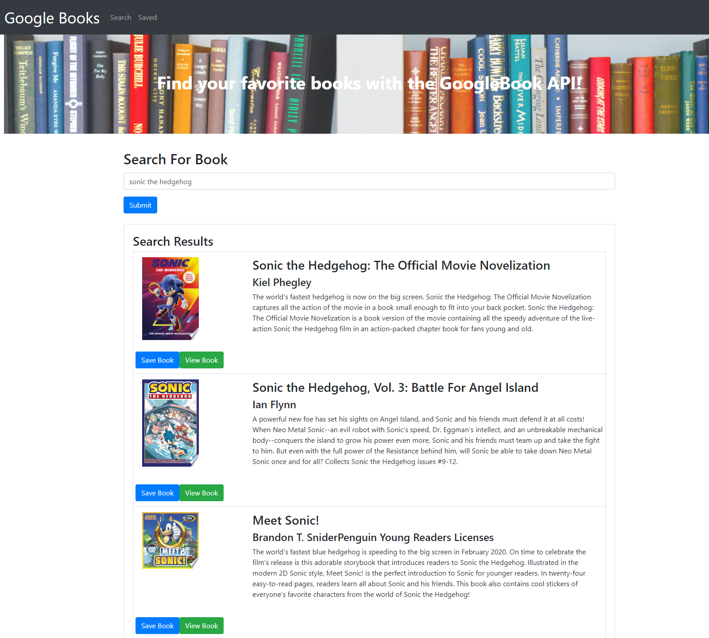
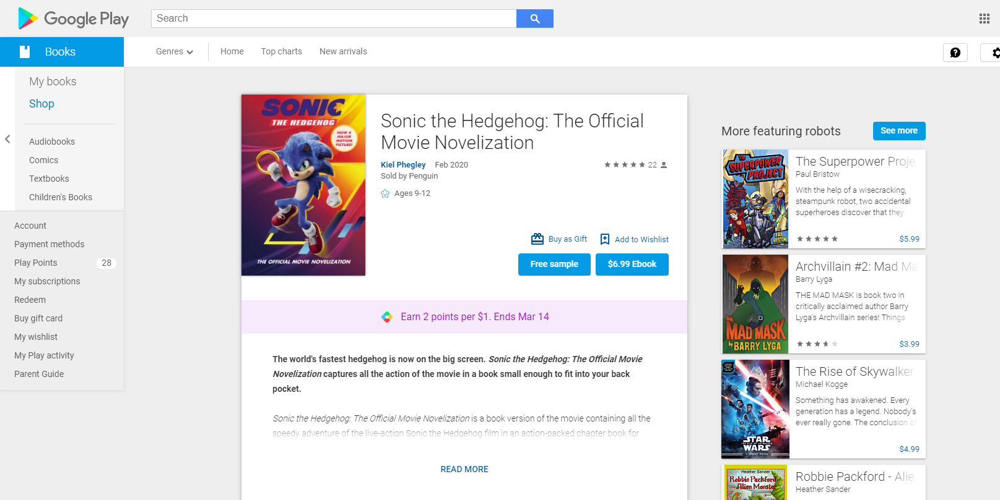
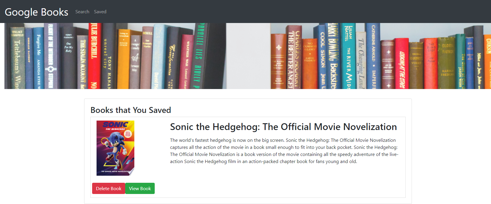

# Google-Book-Search-With-React

## **Description**
A MERN project made with the Google Books API with a search and save functionality. This project required the use of React components, MVC architecture, and utilize React lifecycle methods to query and display books based on user searches. This required the use of Node, Express and MongoDB so that users can save books to review or purchase later.

 

## Table of Contents

* [Screenshot](#screenshot)
* [Link to project](#link)
* [License](#license)
* [Questions](#questions)

## **Screenshot**

Here is a photo of the Progressive Budget application and it's features.

# Link to project 
Look at the live version through Heroku [here.](https://google-books-react-api.herokuapp.com/)

## **License**

## **Questions**

Please contact <renteriamp96@gmail.com> if you have any questions and be sure to check out my other project!